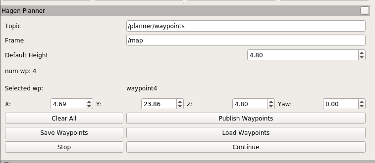
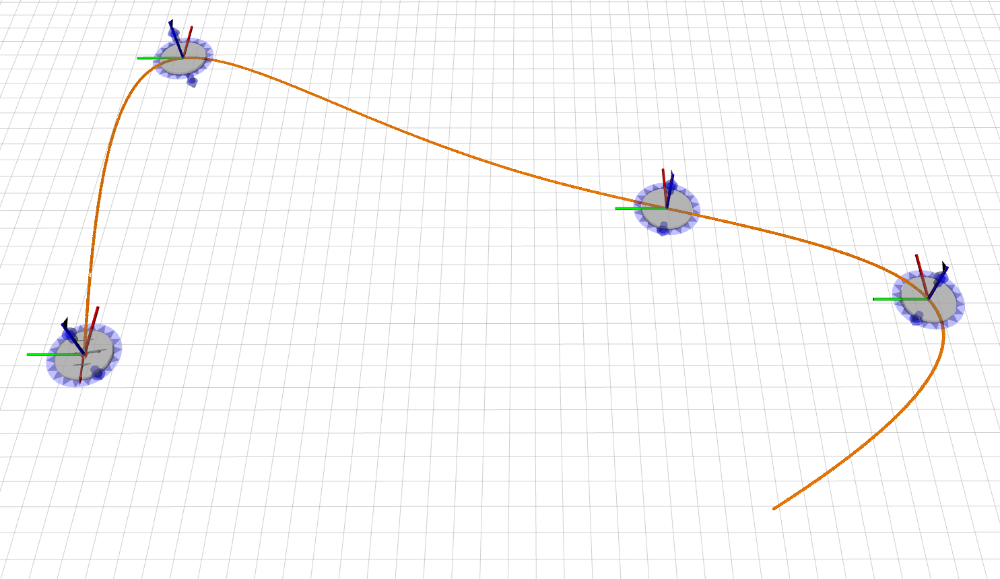
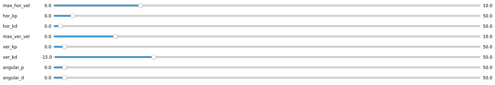

# NMPC Trajectory Tracker

## If you do not have docker on your computer, follow the instructions provided here :https://docs.docker.com/engine/install/ubuntu/

## Main steps for launching the simulator and related artifacts 

### To start the docker container first time 
    xhost + 
    docker run -it --privileged -v /tmp/.X11-unix:/tmp/.X11-unix:ro -e DISPLAY=${DISPLAY} --name=drone_node  prathap/drone_node:v1 /bin/bash

### To start the docker container later times  
    docker start drone_node
    docker exec -it drone_node bash 

### To run the simulator (Gazebo and Rviz)
    roslaunch drone_sim sim.launch

### To run the nmpc trajecotry tracker 
    roslaunch state_machine fsm_trajectory_tracker.launch

### To run the PD regulator 
    roslaunch state_machine px4_reg.launch
    
### To take off the drone 
    roslaunch state_machine take_off.launch 

## 1. How to define the reference trajectory? 
   You can define in rviz in the following way:
   

    
   

   Ones you defined set of waypoints, you can generate the initial reference trajectory by clicking the "Publish wWaypoints" in result you would see a trajectory:
   

    
   

## 2. What are the basis fine tuning of the NMPC trajectory tracker?
   
   You can modify these values in `fsm_trajectory_tracker.launch`, which can be found in `roscd state_machine/launch` directory 
   
   > name="max_vel" value="0.4" # maximum allowed velocity (m/s)

   > name="min_vel" value="-0.4" # minimum allowed velocity (m/s)

   > name="max_avoidance_distance" value="1.0" # distance between close-in obstacles and quadrotor (m)

   > name="map_resolution" value="0.2" # map resolution (m)

   > name="maximum_acceptable_error" value="0.05" # acceptance error to verify whether quadrotor reached to final terminal pose 

   > name="max_vel_bspline" value="0.3" # maximum allowed velocity when generating initial reference (m/s)trajectory

   > name="max_acce_bspline" value="0.1" # maximum allowed acceleration when generating initial (m/s^2) reference trajectory

   > name="prediction_horizon" value="10" # prediction horizon of nmpc 
   

## 3. How to fine turn the PD regulator?
  PD is regulator can be fine tuned in an online fashion changing dynamic parameters, which can be found launching the `rqt` 
  

    
  

## 4. If you want to know more information: https://www.researchsquare.com/article/rs-963714/v2
